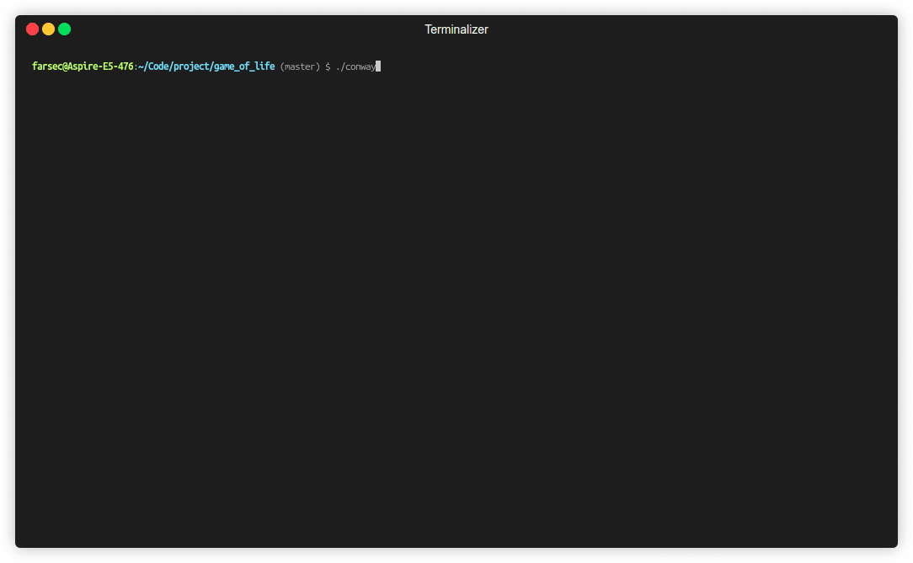

# Game of Life

An implementation of **Conway's Game of Life**, a zero-player cellular automaton devised by British mathematician John Horton Conway in 1970.  

It's a simulation of cells on an infinite two-dimensional grid, where each cells can be in one of two state: **live** or **dead**. The state of each cells in the next generation is determined by the states of its eight neighboring cells.

---

---

##  Rules
1. Any live cell with **two or three live neighbors** survives.
2. Any live cell with **fewer than two live neighbors** dies.
3. Any live cell with **more than three live neighbors** dies.
4. Any dead cell with **exactly three live neighbors** becomes a live cell. 

---

## References
- [Conway’s Game of Life – Wikipedia](https://en.wikipedia.org/wiki/Conway%27s_Game_of_Life)
- [MathWorld – Conway’s Game of Life](https://mathworld.wolfram.com/GameofLife.html)
